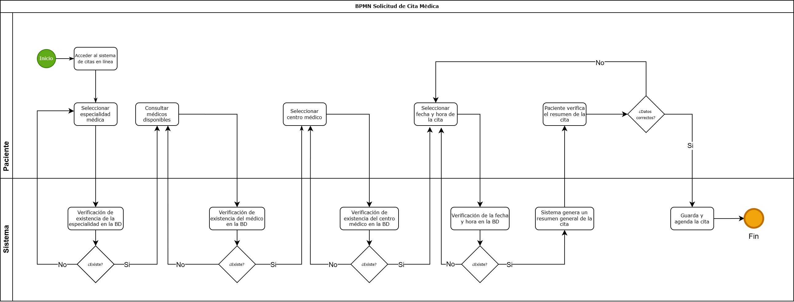

# 🗒️ Registro de Trabajo en Clase - Taller 1

## 📆 Fecha de la sesión

13 de febrero de 2026

## 👥 Integrantes presentes

* Sofia Vargas Garzon
* Juan David Moreno Suarez
* Jaime Andres Olarte
* Oscar Vergara

## 🧠 Actividades realizadas en clase

Durante la sesión, el equipo analizó el proceso de agendamiento de citas médicas del caso base proporcionado. Inicialmente, se discutió el flujo general del proceso, identificando el evento de inicio, las actividades realizadas por el paciente, las validaciones realizadas por el sistema y el evento de fin.

Se tomaron decisiones de modelado como separar las responsabilidades utilizando lanes para diferenciar las acciones del paciente y del sistema, así como incluir gateways exclusivos para representar las validaciones de información, como la verificación de la especialidad, el médico y la disponibilidad de la cita. También se definió que el proceso debía representarse de forma secuencial, asegurando que el flujo fuera lógico y fácil de comprender.

Para el desarrollo del modelo se utilizó la herramienta draw.io, donde se construyó el diagrama BPMN utilizando los elementos estándar como eventos, actividades y gateways. Durante la sesión, se logró desarrollar el modelo completo del caso base, representando todas las actividades principales, las decisiones y el flujo general del proceso.

## 🧩 Boceto inicial del modelo

Se realizó directamente el modelo en formato digital utilizando draw.io, donde se definió el flujo completo del proceso, incluyendo los actores, las actividades y las decisiones principales.

## 🔁 Tareas definidas para complementar el taller

| Tarea asignada                                    | Responsable              | Fecha estimada |
| ------------------------------------------------- | ------------------------ | -------------- |
| Modelado final del proceso del cliente en draw.io | Todo el grupo | 13/02/2026     |
| Redacción del informe técnico                     | Juan David Moreno Suarez      | 13/02/2026     |
| Investigación y referencias BPMN                  | Jaime Andres Olarte y Oscar David Vergara     | 13/02/2026     |
| Organización del repositorio y documentación      | Juan David Moreno Suarez | 13/02/2026     |

*Este documento resume el trabajo colaborativo realizado durante la sesión del Taller 1 en el curso Arquitectura Empresarial - Universidad de La Sabana.*
