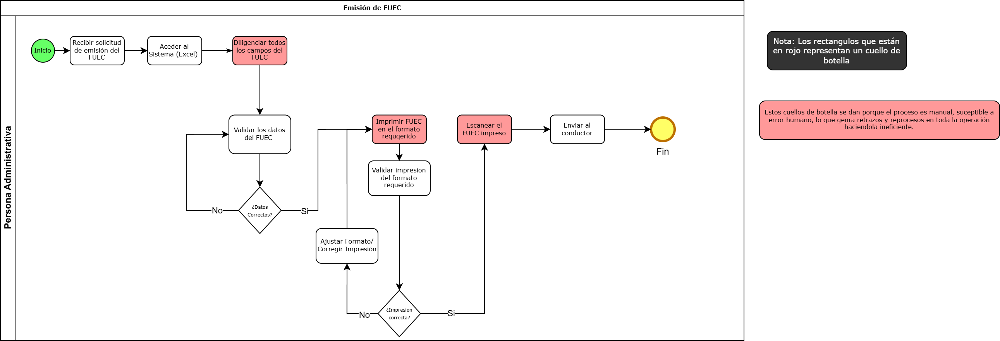

# 📄 Informe Técnico del Taller

## 🔖 Nombre del Taller

Taller 1 - Modelado de Procesos de Negocio con BPMN

## 👥 Integrantes del equipo

* Sofia Vargas Garzon
* Juan David Moreno Suarez
* Jaime Andres Olarte
* Oscar Vergara

## 🧠 Descripción general del trabajo

Este taller tuvo como objetivo modelar el proceso de generación del Formato Único de Extracto del Contrato (FUEC) de la empresa TRANS CAPITAL S.A.S utilizando la notación BPMN. El FUEC es un documento obligatorio que certifica la legalidad de los servicios de transporte prestados, incluyendo información del conductor, vehículo y servicio. El modelado permitió representar gráficamente el flujo actual del proceso, facilitando su comprensión, análisis e identificación de oportunidades de mejora.

## 🔧 Proceso de desarrollo

El desarrollo inició con el análisis del proceso real de generación del FUEC, identificando las actividades involucradas desde la solicitud del documento hasta su envío al conductor. Se determinó que el proceso es manual y depende completamente del personal administrativo.

Posteriormente, se identificaron los elementos BPMN necesarios, como el evento de inicio, las actividades, el punto de decisión relacionado con la verificación de la información y el evento de fin. Se utilizó draw.io como herramienta para construir el diagrama, organizando el flujo de manera secuencial y clara. Durante el modelado, se realizaron ajustes para asegurar que el diagrama representara correctamente el proceso real.

## 🧩 Análisis del modelo propuesto

El modelo se estructura de forma secuencial, iniciando con la necesidad de generar el FUEC, seguido por el diligenciamiento de la información en Excel, la verificación de los datos, la impresión del documento, su digitalización y su envío final.

El modelo representa adecuadamente las necesidades de la empresa, ya que refleja el flujo real utilizado para generar el documento, así como el rol principal del personal administrativo en todas las actividades.

Se asumió que la verificación de la información es un punto crítico del proceso, ya que los errores en la digitación pueden afectar la validez del documento. También se consideró que el proceso es completamente manual y no cuenta con automatización.

## 📈 Diagrama final entregado

## 📋 Tabla de actores, entidades o componentes

| Nombre del elemento     | Tipo        | Descripción                                                     | Responsable             |
| ----------------------- | ----------- | --------------------------------------------------------------- | ----------------------- |
| Personal administrativo | Actor       | Encargado de diligenciar, verificar, generar y enviar el FUEC   | TRANS CAPITAL S.A.S     |
| FUEC                    | Documento   | Documento que certifica la legalidad del servicio de transporte | TRANS CAPITAL S.A.S     |
| Plantilla Excel         | Herramienta | Archivo utilizado para registrar la información del FUEC        | Personal administrativo |

## 🔍 Investigación complementaria

### Tema investigado:

Buenas prácticas en el modelado de procesos utilizando BPMN.

### Resumen:

BPMN es un estándar internacional que permite representar procesos de negocio de forma visual, facilitando su análisis y comprensión. Su uso permite identificar claramente las actividades, actores y decisiones dentro de un proceso.

Entre las buenas prácticas se encuentra el uso correcto de eventos, actividades y gateways, así como la representación clara del flujo del proceso. Esto facilita la identificación de mejoras y optimizaciones.

En este taller, BPMN permitió representar el proceso de generación del FUEC de forma clara, facilitando su análisis y permitiendo comprender su estructura y funcionamiento.

## 📚 Referencias

* [1] Object Management Group. *Business Process Model and Notation (BPMN) Version 2.0*. [https://www.omg.org/spec/BPMN/](https://www.omg.org/spec/BPMN/)
* [2] Camunda. *BPMN Reference Guide*. [https://camunda.com/bpmn/reference/](https://camunda.com/bpmn/reference/)